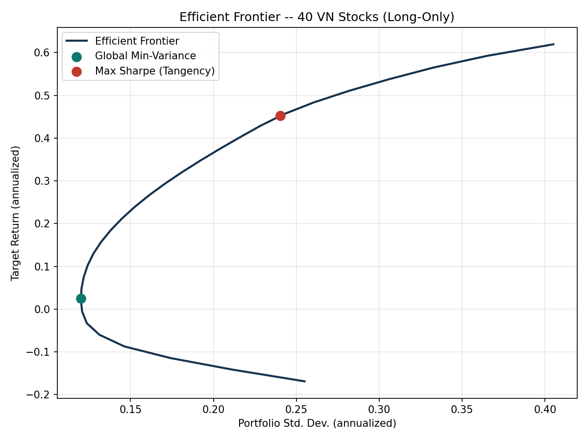
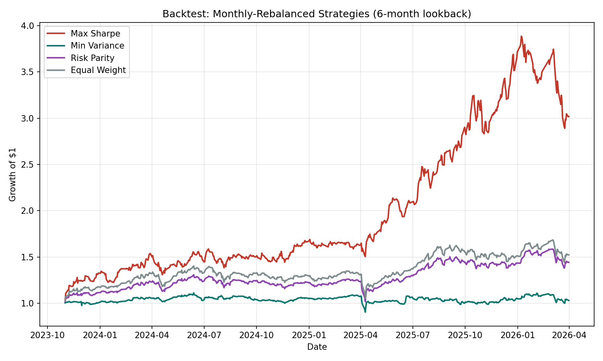

# VN Equity Portfolio Optimization: MVO vs. Risk Parity

A from-scratch Python reimplementation and extension of a Markowitz mean-variance
portfolio problem originally solved with Excel Solver, built on 3 years of daily
price data for 40 stocks listed on the Vietnamese stock market (2023-03 to 2026-03).

## What this project does

1. **Data pipeline** (`src/data_prep.py`) — loads raw daily prices, computes
   simple daily returns, and derives annualized expected returns and the
   covariance matrix.
2. **Mean-Variance Optimization** (`src/mvo.py`) — solves the classic Markowitz
   problem with [`cvxpy`](https://www.cvxpy.org/) as a convex quadratic program:
   - Global Minimum-Variance portfolio
   - Maximum-Sharpe (tangency) portfolio
   - Full efficient frontier (target return vs. risk)
3. **Risk Parity** (`src/risk_parity.py`) — solves for the Equal Risk
   Contribution portfolio with `scipy.optimize` (SLSQP), where every asset
   contributes an equal share of total portfolio variance rather than being
   sized by expected-return forecasts.
4. **Walk-forward backtest** (`src/backtest.py`) — re-estimates each strategy's
   weights every month using only a trailing 6-month lookback window (no
   look-ahead bias), holds the weights for the following month, and compares
   Max-Sharpe, Min-Variance, Risk Parity, and an Equal-Weight (1/N) benchmark.
5. **Visualization** (`src/visualize.py`) — efficient frontier chart and
   cumulative growth-of-$1 chart across all four strategies.

## Why Risk Parity, not just MVO

Mean-variance optimization is highly sensitive to estimation error in expected
returns — small changes in `mu` can swing weights dramatically, which is why
the Max-Sharpe portfolio below concentrates almost half its weight in a single
stock (VIC). Risk Parity ignores expected returns entirely and instead
equalizes each asset's *risk contribution*, producing a much more diversified,
lower-turnover portfolio. Comparing the two head-to-head in a backtest — rather
than just computing weights once — is the point of this project.

## Results (backtest: Nov 2023 -- Mar 2026, monthly rebalancing)

| Strategy      | Annualized Return | Annualized Volatility | Sharpe Ratio | Max Drawdown |
|---------------|-------------------:|-----------------------:|-------------:|-------------:|
| Max Sharpe    | 59.1%              | 28.6%                  | 1.96         | -25.6%       |
| Min Variance  | 1.3%               | 14.5%                  | -0.12        | -18.7%       |
| Risk Parity   | 16.7%              | 17.6%                  | 0.77         | -22.1%       |
| Equal Weight  | 19.4%              | 20.2%                  | 0.81         | -24.8%       |

*Sharpe ratio computed against a 3% annualized risk-free rate assumption.*

**Reading the results:** Max-Sharpe's live backtest return is far higher than
its in-sample estimate would suggest here — a reminder that a portfolio
optimized on trailing data can get lucky (or unlucky) out-of-sample,
especially when concentrated in a few names. Risk Parity's more even
diversification shows up as steadier, less extreme performance relative to
Equal Weight — the two are much closer to each other than either is to
Max-Sharpe, which is the expected pattern when return forecasts are noisy but
the covariance structure is comparatively stable.




## How to run

```bash
pip install pandas numpy scipy cvxpy matplotlib
cd src
python data_prep.py      # sanity-check the data pipeline
python mvo.py             # global min-variance + max-Sharpe portfolios
python risk_parity.py     # equal risk contribution portfolio
python backtest.py        # full walk-forward backtest -> outputs/*.csv
python visualize.py       # generates outputs/*.png
```

## Data

`data/vn_stock_prices_raw.csv` — daily closing prices for 40 VN-listed stocks
(HPG, VIC, VNM, MBB, FPT, etc.) plus the VNINDEX benchmark, 2023-03-31 to
2026-03-31 (747 trading days).

## Limitations / next steps

- Expected returns are estimated from trailing historical means, which are
  known to be noisy predictors — a natural extension would be to test
  shrinkage estimators (e.g. Ledoit-Wolf for the covariance matrix, or a
  Black-Litterman approach for expected returns).
- No transaction costs are modeled in the backtest; monthly rebalancing with
  meaningfully different weights each period would incur real trading costs.
- The lookback window (126 trading days) is a fixed hyperparameter — results
  are somewhat sensitive to this choice and were not tuned to avoid
  overfitting the backtest period.
