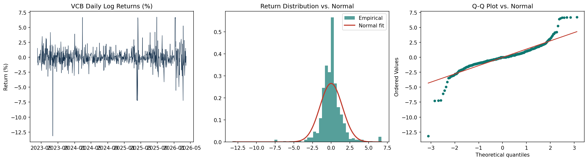
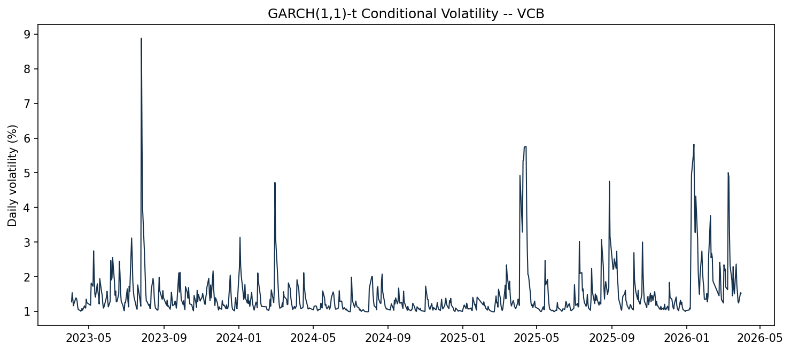
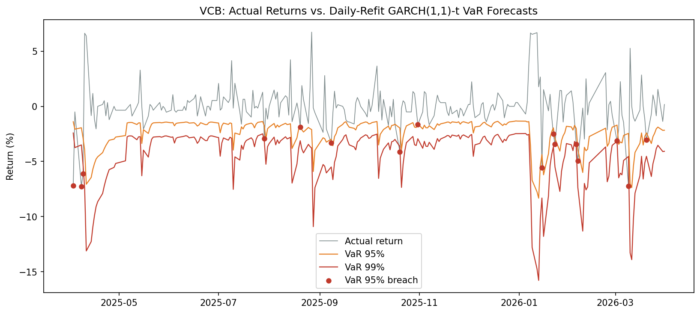

# 📉 GARCH Volatility Modeling & VaR Backtesting (with CVaR Forecasting)

<p align="left">
  
  
  
  
  
</p>


## 📌 Executive Summary

I wanted to see how well a GARCH model can capture changing stock volatility, and whether those forecasts are actually useful for measuring downside risk — not just theoretically, but when you formally check them against what happened.

I started with **VCB** as a case study, using GARCH(1,1) with both Normal and Student-t innovations to forecast one-day-ahead **VaR and CVaR**. I then backtested the VaR forecasts using the **Kupiec** and **Christoffersen** tests before extending the analysis to 40 Vietnamese stocks.

The main takeaway wasn't simply whether GARCH could produce reasonable VaR forecasts. The more interesting result was that **breach frequency and breach timing tell different stories**: 88% of stocks pass the Kupiec test at the 95% level, but only 62% pass the stricter conditional-coverage test.

I also used a **daily-refit walk-forward procedure** to make sure each VaR forecast only reflects information available up to that point in time, and formally backtested the results with the Kupiec and Christoffersen tests rather than just reporting breach counts.

---

## 💻 Tech Stack

* **Language:** Python 3
* **Volatility Modeling:** `arch` — GARCH(1,1), Normal vs. Student-t innovations
* **Statistical Testing:** `scipy.stats`, `statsmodels` — ADF, Jarque-Bera, ARCH-LM
* **Risk Backtesting:** Kupiec (1995), Christoffersen (1998), joint conditional coverage
* **Data Wrangling:** `pandas`, `numpy`
* **Visualization:** `matplotlib`
* **Data:** 40 Vietnamese listed equities, daily closing prices, 2023-03-31 to 2026-03-31

> `sympy` was used separately, outside this notebook, to symbolically verify the Christoffersen
> likelihood formula during development — it's not a runtime dependency and isn't imported by
> the notebook itself, so it's not required to run anything here.

---

## 📁 Repository Structure

```text
Volatility-Risk-Modeling/
│
├── data/
│   └── vn_stock_prices_raw.csv
│
├── notebooks/
│   └── garch_var_cvar.ipynb
│
└── outputs/
    ├── return_distribution_qq.png
    ├── garch_conditional_volatility.png
    ├── var_backtest_vcb.png
    ├── cross_sectional_tail_comparison.png
    ├── distributional_tests_40stocks.csv
    └── full_40stock_var_backtest.csv
```

---

## 📂 Dataset Overview

### Key Metrics — VCB

VCB is used as the primary case study before extending the analysis to the full 40-stock universe.

* **Sample:** 746 daily log returns, 2023-04-03 to 2026-03-31
* **Mean daily return:** -0.0059%
* **Standard deviation:** 1.50%
* **Skewness:** -0.59
* **Excess kurtosis:** 13.19
* **Out-of-sample period:** 246 daily forecasts
* **Training window:** 500 trading days
* **Refit frequency:** Daily

---

## 🔬 Modeling Framework

The project follows a complete volatility and downside-risk modeling pipeline:

**Return Diagnostics → GARCH Volatility Model → VaR/CVaR Forecasting → Walk-Forward Backtesting → Cross-Stock Comparison**

### Why GARCH?

The diagnostics answer three different questions:

| Diagnostic                 | What it checks                    | Modeling implication                                  |
| -------------------------- | --------------------------------- | ----------------------------------------------------- |
| **ADF**                    | Is the return series stationary?  | Provides evidence that the return series is stationary              |
| **ARCH-LM**                | Is there volatility clustering?   | Provides evidence for conditional volatility modeling |
| **Jarque-Bera + Q-Q plot** | Are returns normally distributed? | Motivates heavy-tailed innovations                    |

For VCB:

* ADF statistic = **-25.62**, p < 0.000001 → stationary
* ARCH-LM statistic = **39.00**, p < 0.000001 → significant ARCH effects
* Jarque-Bera = **5369.5**, p < 0.000001 → strong departure from normality

The key point is that these tests support **different modeling decisions** rather than serving as one blanket justification for GARCH.

---

## 📊 Key Findings & Insights

### 1. VCB returns are stationary, heavy-tailed, and show clear volatility clustering

The return series is stationary, but the more important evidence for volatility modeling comes from the **ARCH-LM test**, which finds significant conditional heteroskedasticity.

The Jarque-Bera test and Q-Q plot also show that VCB returns have much heavier tails than a normal distribution, with **excess kurtosis of 13.19**.



**Insight:** Before choosing a model, I wanted to check whether the data actually supported its assumptions instead of starting with GARCH by default — stationarity, volatility clustering, and fat tails are three separate checks, not one.

---

### 2. Student-t GARCH provides a substantially better fit than Normal-GARCH

I fitted GARCH(1,1) under both Normal and Student-t innovations and compared their fit using log-likelihood, AIC, and BIC.

|                | Normal-GARCH | Student-t-GARCH |
| -------------- | -----------: | --------------: |
| Log-likelihood |      -1292.2 |     **-1169.6** |
| AIC            |       2592.4 |      **2349.2** |
| BIC            |       2610.8 |      **2372.2** |

Student-t provides the better fit across all three metrics.

For VCB, the fitted Student-t GARCH parameters are:

* **ω = 0.563**
* **α = 0.452**
* **β = 0.419**
* **α + β = 0.871**
* **ν ≈ 3.14**

The persistence estimate **α + β = 0.871** indicates persistent but mean-reverting conditional volatility under the standard GARCH(1,1) framework.

The estimated degrees of freedom **ν ≈ 3.14** also imply substantially heavier tails than a normal distribution, consistent with the return diagnostics.



**Insight:** The heavy-tailed distribution wasn't just something I assumed from the data — the Student-t specification also performed better when the two models were actually compared side by side.

---

### 3. Walk-forward VaR forecasting with daily refitting

For each forecast date, the model uses only information available up to that date to avoid look-ahead bias.

I refit the GARCH model **every trading day** using a trailing 500-day window, so each day's VaR forecast reflects that day's own conditional volatility estimate rather than a stale one from several days earlier. This takes approximately five minutes to run across the full 40-stock universe.



**Insight:** A walk-forward backtest is only meaningful if the forecast actually updates as new data becomes available. In this implementation, I refit the model every day using the latest estimation window, so the VaR forecast is recalculated rather than carried forward from an earlier model fit.
---

### 4. VCB VaR forecasts were not rejected by the backtests

Using 246 out-of-sample forecasts:

| Level   | Breaches | Breach Rate | Expected Rate | Kupiec p | Christoffersen p | Conditional Coverage p |
| ------- | -------: | ----------: | ------------: | -------: | ---------------: | ---------------------: |
| VaR 95% |       16 |       6.50% |         5.00% |   0.2999 |           0.0699 |                 0.1131 |
| VaR 99% |        5 |       2.03% |         1.00% |   0.1533 |           0.0579 |                 0.0598 |

At the 5% significance level, VCB is **not rejected** by Kupiec, Christoffersen, or the joint conditional-coverage test at either confidence level.

However, several p-values are relatively close to 0.05, so I would interpret this as **"not rejected" rather than evidence of perfect calibration**.

**Insight:** Passing Kupiec alone isn't enough — a model can get the total number of breaches roughly right while still failing to capture **when** those breaches happen.

---

## 🚨 The Main Takeaway: Breach Frequency ≠ Breach Independence

### 5. The cross-stock results reveal a bigger calibration problem

After the VCB case study, I applied the same daily-refit procedure to **all 40 stocks**.

### Cross-Stock Diagnostics

| Test                     | Result                                  |
| ------------------------ | --------------------------------------- |
| ADF                      | 40/40 stationary (100%)                 |
| Jarque-Bera              | 40/40 reject normality (100%)           |
| ARCH-LM                  | 35/40 show significant clustering (88%) |
| GARCH(1,1)-t convergence | 40/40 converged (100%)                  |

### VaR Backtesting Across All 40 Stocks

| Level   | Kupiec-Only Pass Rate | Conditional-Coverage Pass Rate |
| ------- | --------------------: | -----------------------------: |
| VaR 95% |       35/40 (**88%**) |                25/40 (**62%**) |
| VaR 99% |       36/40 (**90%**) |                35/40 (**88%**) |

The difference is substantial at the 95% level:

**88% pass Kupiec → only 62% pass conditional coverage.**

This means that matching the overall number of breaches is considerably easier than capturing their **temporal dependence**.


**Insight:** A single GARCH(1,1)-t specification does not calibrate equally well across every stock. This made me realize that risk models should be validated at the **individual-asset level** rather than assuming that one specification generalizes equally well across an entire universe.

---

### 6. Some stocks push GARCH persistence to the boundary

10 of 40 stocks show persistence estimates **α + β ≥ 0.9999**:

`KDC`, `TLH`, `CNG`, `KDH`, `VIC`, `DGC`, `CMG`, `VHM`, `GAS`, `VSC`

These estimates sit extremely close to the GARCH stationarity boundary.

With only about 2.4 years of data, I don't think this is enough evidence to claim genuinely permanent volatility persistence. The optimizer may simply be converging near a boundary on a relatively short sample.

A longer history or an explicit IGARCH comparison would be needed before drawing a stronger conclusion.

**Insight:** One thing I learned here is that a model output can be statistically interesting without necessarily having an obvious economic interpretation attached to it yet.

---

## 🧪 Understanding the Backtests

The project uses two complementary VaR diagnostics.

### Kupiec — Unconditional Coverage

Kupiec tests whether the observed VaR breach frequency is consistent with the expected rate.

For example:

* VaR 95% → expected breach rate = **5%**
* VaR 99% → expected breach rate = **1%**

A rejection means the model produces significantly too many or too few breaches.

### Christoffersen — Independence

Christoffersen tests whether VaR breaches are independent over time.

This matters because breaches can **cluster** even when the total number of breaches looks reasonable.

The test examines transitions between:

* `0` = no breach
* `1` = breach

In particular, **n₁₁ counts consecutive breach-to-breach transitions**, making it possible to detect clustering that Kupiec cannot detect.

### Conditional Coverage

The joint test combines unconditional coverage and independence:

$$
LR_{CC} = LR_{UC} + LR_{IND}
$$

Under the null hypothesis, the VaR model has both:

1. the correct overall breach frequency, and
2. independent breaches over time.

This is why the conditional-coverage result is more informative than looking at the Kupiec result alone.

---

## ⚠️ A Note on the Christoffersen Test's `NaN` Case

If one of the two transition states (breach / no-breach) does not occur at all in the sample, some transition probabilities cannot be estimated and the test returns `NaN` instead of a p-value. This reflects a genuine limitation of the statistical calculation — independence isn't testable without observing transitions from both states — rather than a data or code issue.

I verified the restricted-likelihood formula symbolically with SymPy (outside the notebook, as a one-off check) before relying on it for the reported results.

---

## 🔍 Next Steps

* **Investigate the worst-calibrated stocks individually**, such as `KDC`, `NLG`, and `KDH`, instead of treating the 62% pass rate as one aggregate result.
* **Run a formal CVaR backtest.** CVaR is forecast throughout the analysis, but it is not independently validated here.
* **Test IGARCH** for the 10 stocks near the persistence boundary.
* **Extend the sample period** beyond ~2.4 years to make the persistence and cross-sectional calibration results more reliable.
* **Test alternative specifications**, such as GJR-GARCH, for stocks where asymmetric volatility or weak ARCH effects may make standard GARCH less appropriate.

---

## 📌 Limitations

* The out-of-sample period contains only around **246 trading days**, which is relatively small for evaluating 1% VaR.
* Daily refitting is computationally heavier than more efficient recursive updating approaches.
* VaR is modeled parametrically using Student-t innovations; historical simulation could provide an additional robustness check.
* Each stock is modeled independently, so this project does not estimate **portfolio-level VaR or time-varying correlations**.
* CVaR is forecast at every step but **not independently backtested**.
* 10/40 stocks have persistence estimates at or very close to α + β = 1; these cases require further investigation rather than a strong interpretation.
* The same GARCH(1,1)-t specification is applied across all stocks, although some assets may require alternative volatility specifications.

---

## ▶️ How to Run

```bash
pip install pandas numpy scipy arch statsmodels matplotlib jupyter
jupyter notebook notebooks/garch_var_cvar.ipynb
```

---

## 🛠️ Tools

**Python · pandas · NumPy · SciPy · `arch` · statsmodels · Matplotlib · Jupyter Notebook**
