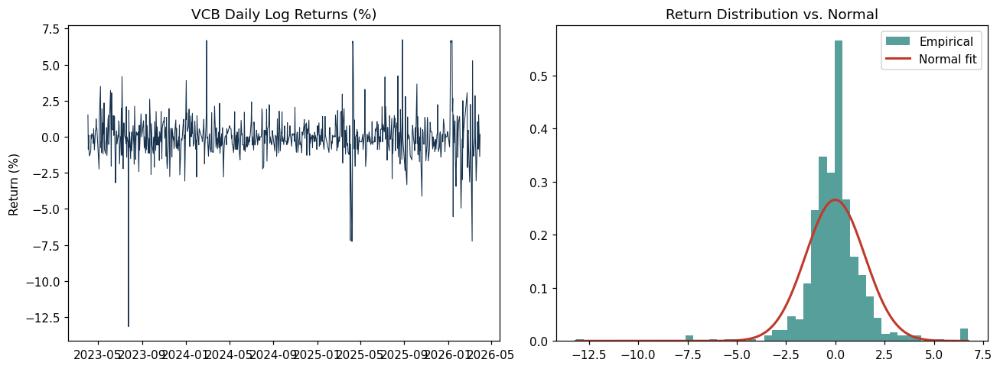
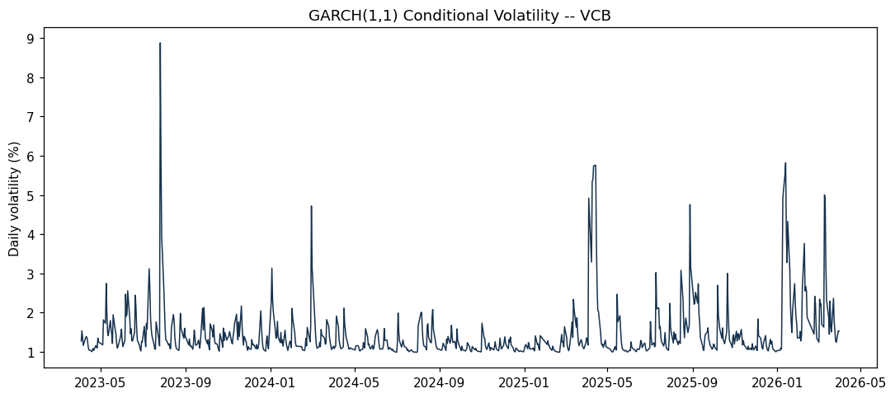
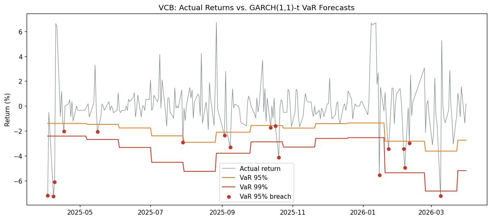
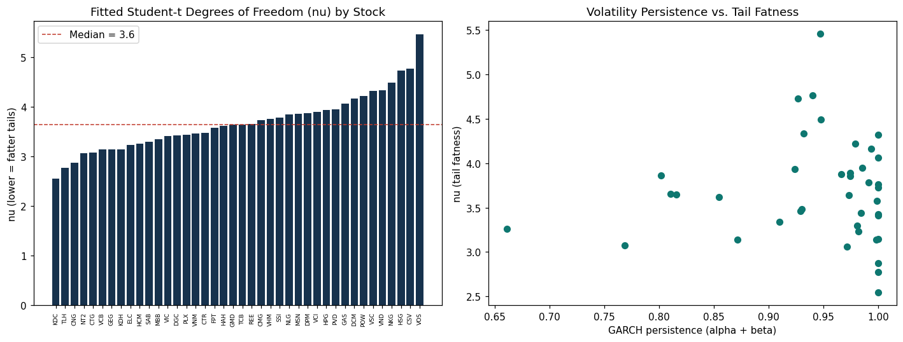

# GARCH Volatility Modeling & VaR/CVaR Backtesting: VCB

Extends a preliminary return-distribution analysis (histogram, skew/kurtosis, Jarque-Bera
normality test) into a full risk-modeling pipeline: fit a GARCH(1,1) model with Student-t
errors, forecast Value-at-Risk and Conditional VaR walk-forward, and backtest the forecasts'
calibration with the Kupiec proportion-of-failures test.

## What this project does

1. **Descriptive statistics & distributional tests (VCB)** -- confirms non-normal, heavy-tailed
   returns (Jarque-Bera) and volatility clustering (ARCH-LM test), motivating a GARCH model.
2. **GARCH(1,1) with Student-t innovations** -- fitted via the `arch` package; the estimated
   degrees-of-freedom parameter (nu ~ 3.1 for VCB) independently confirms the fat-tailed finding.
3. **Walk-forward VaR / CVaR (VCB)** -- forecasts next-day VaR and Expected Shortfall at the
   95%/99% levels using only trailing data (no look-ahead bias), from closed-form Student-t
   formulas.
4. **Kupiec backtest (VCB)** -- formally tests whether the realized breach rate matches the
   stated confidence level.
5. **Cross-sectional extension (all 40 stocks + 6-stock basket)** -- fits the same model
   universe-wide to check how much tail behavior varies by stock, then repeats the full
   walk-forward VaR backtest on a sector-diverse basket to test whether VCB's good calibration
   generalizes.

## Key results

**Single-stock deep dive (VCB):**

| Metric | VaR 95% | VaR 99% |
|---|---:|---:|
| Expected breach rate | 5.00% | 1.00% |
| Observed breach rate | 6.91% | 2.44% |
| Kupiec p-value | 0.19 | 0.06 |
| Verdict | Well-calibrated | Well-calibrated (borderline) |

**Extension: does it generalize? (Section 8)** The same GARCH(1,1)-t is fitted independently
across all 40 stocks in the dataset (all 40 converge), then walk-forward VaR-backtested on a
6-stock basket spanning banking, real estate, steel, consumer staples, technology, and energy:

| Ticker | Sector | VaR 95% calibrated? | VaR 99% calibrated? |
|---|---|---|---|
| HPG | Steel | Yes (p=0.84) | Borderline (p=0.06) |
| FPT | Technology | Yes (p=0.19) | Yes (p=0.15) |
| VCB | Banking | Yes (p=0.19) | Borderline (p=0.06) |
| VIC | Real Estate | **No (p=0.002)** | **No (p=0.02)** |
| VNM | Consumer Staples | **No (p=0.01)** | **No (p=0.02)** |
| GAS | Energy | **No (p<0.001)** | Yes (p=0.15) |

**Half the basket fails the 95% Kupiec calibration test.** VCB's good result does not generalize
uniformly -- this is evidence the methodology can produce well-calibrated forecasts, not that a
single fixed GARCH(1,1)-t specification is automatically reliable across every VN stock.






## How to run

```bash
pip install pandas numpy scipy arch statsmodels matplotlib jupyter
jupyter notebook notebooks/garch_var_cvar.ipynb
```

## Data

`data/vn_stock_prices_raw.csv` -- daily closing prices for all 40 VN-listed stocks used in
the [Portfolio Optimization project](../Portfolio-Optimization), 2023-03-31 to 2026-03-31.
VCB is the primary deep-dive example; the full universe is used in Section 8.

## Limitations

- **Fixed refit frequency.** Refitting every 20 days (for computational speed) means the model
  can lag a true volatility regime change by up to that many days.
- **Backtest sample size.** 246 out-of-sample days per stock is modest for a 1%-level VaR test,
  where only ~2-3 breaches are expected under correct calibration -- the Kupiec test has limited
  power to distinguish "borderline" from "actually fine" at this tail.
- **Parametric VaR assumes the fitted Student-t shape is stable.** A historical-simulation
  approach would be a useful robustness check.
- **No multivariate / portfolio-level VaR.** Each stock is modeled independently; a true
  portfolio VaR would need a joint model of time-varying correlations (e.g. DCC-GARCH), not
  just each asset's own volatility.
- **One fixed GARCH(1,1)-t specification applied to all 40 stocks.** Section 8 shows this
  doesn't calibrate equally well everywhere -- a natural next step would be testing whether
  asset-specific tuning (e.g. GJR-GARCH for assets with strong asymmetric/leverage effects)
  closes the gap for the stocks that failed Kupiec here (VIC, VNM, GAS).
